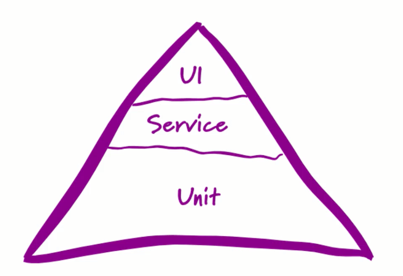

Piramide representativa aos tipos de testes, idealizada pelo criador do TDD - Martin Fowler.

- Na base
Testes unitários: Testar como um método funciona de forma isolada.

- No meio
Testes integração: Chamadas a api, ao DB por exemplo.

- Topo
Testes E2E: Testes na interface, automação.

Obs: A piramide também representa a quantidade de testes, logo teste unitários são a grande maioria.
